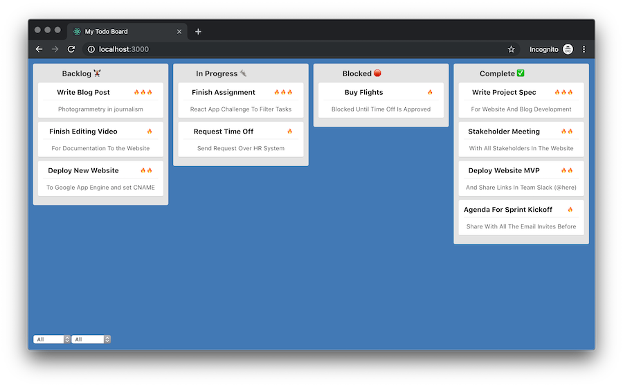

## New York Times R&D Web Assignment
Hi and welcome to the New York Times R&D web engineering assignment

- [Getting Started](#getting-started)
- [Goals](#goals)
- [Submitting](#submitting)
- [Available Scripts](#available-scripts)

## Getting Started
To get started, clone the repository and use `npm` or `yarn` to install all the dependencies, e.g:
```sh
git clone repo && cd repo && yarn install
```

You can easily start the development server by running the start command (see [Available Scripts](#available-scripts) for all options). e.g:
```
yarn start
```

Once the server is running you should see our Todo web app in your browser, it should look something like this


Neat 🔥 Next, Let's dive into the challanges!

## Goals
- [ ] Implement vieweing the tasks by lane id in the `filterTasks` method in `App.js`
- [ ] *Bonus?* implement another test in `App.test.js` that tests a single aspect of the app's functionality (e.g `it("constructor init with correct task default filter")`). Make sure you run `yarn test` to verify the test works as expected.

## Submitting
To submit simply commit your solution to the Github Classroom repository you created and submit the solution.

## Available Scripts

In the project directory, you can run:

### `yarn start`

Runs the app in the development mode.<br />
Open [http://localhost:3000](http://localhost:3000) to view it in the browser.

The page will reload if you make edits.<br />
You will also see any lint errors in the console.

### `yarn test`

Launches the test runner in the interactive watch mode.<br />
See the section about [running tests](https://facebook.github.io/create-react-app/docs/running-tests) for more information.

### `yarn build`

Builds the app for production to the `build` folder.<br />
It correctly bundles React in production mode and optimizes the build for the best performance.

The build is minified and the filenames include the hashes.<br />
Your app is ready to be deployed!

See the section about [deployment](https://facebook.github.io/create-react-app/docs/deployment) for more information.

> This project was bootstrapped with [Create React App](https://github.com/facebook/create-react-app).